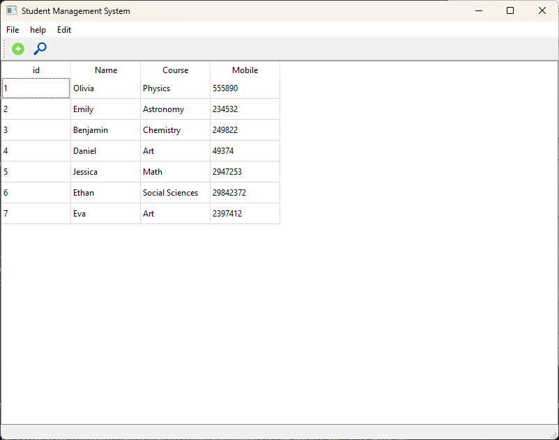
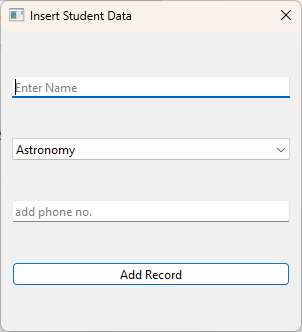
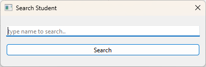
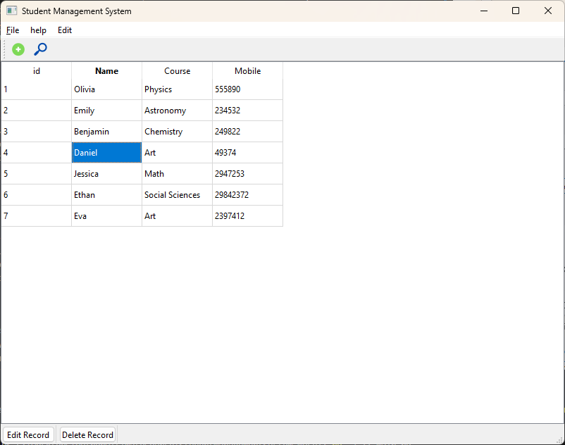
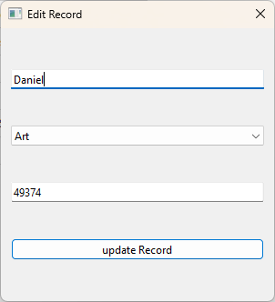
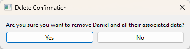

# About this repository
 This repository creates a web app that can be used as a student management system.
 The GUI is created using <b>PyQt6</b>
 The database is created in <b>Sqlite</b>.
 The start window looks like the following:

## Features
 - <b>Add student record</b>: To add a student in the table, go to <i>File</i> > <i>Add Student</i> or press the  icon in the toolbar. This opens up the following window:

press <i>Add Record</i> to add the student to the database
 
- <b>Search student record</b>: To search for a student by name in the table, go to <i>Edit</i> > <i>Search</i> or press the  icon in the toolbar. This opens up the following window
 
 Type the student name and press <i>Search</i>. If the name exists in the database it will be highlighted in main window(just like the image below, if the search name was 'Daniel').
  
- <b>Edit student record</b>: To edit the record of an existing student, select the student in the table(e.g., Daniel in the image below) and press <i>Edit Record</i> in the statusbar at the bottom of the window

 This opens up the record details that can be edited. Press <i>Update Record</i> to update it in the dataabse. 
 
  
- <b>Remove Record</b>: To remove a student record,select the student in the table and press <i>Delete Record</i> in the statusbar at the bottom of the window. This brings up the following window for confirmation.

 press <i>Yes</i> to delete the record.

# How to run
After cloning it to a local directory, the desktop app can be launched using :
<code>py -3 main.py</code> (for windows)
<code>python3 main.py</code> (for mac/linux)

## Dependencies

<pre>
PyQt6==6.5.2
PyQt6-Qt6==6.5.2
PyQt6-sip==13.5.2
</pre>

The `requirements.txt` file is also included